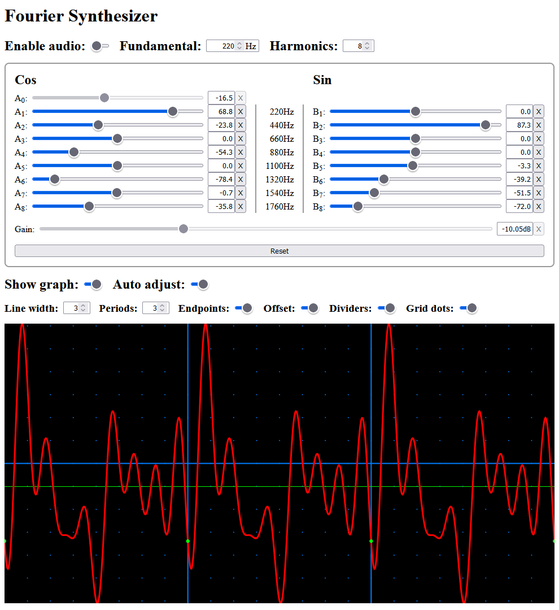

# [Fourier Synthesizer Web Component](https://github.com/gtranter/fourier-synth)

This project is a standalone Web Component for generating waveforms and audio using Fourier synthesis.


<br></br>

# Demo

[Link to demo page](https://unpkg.com/fourier-synth@1.0.2/fourier-synth.html)
<br></br>

# Develop

For information about development using this project see [DEVELOP.md](./DEVELOP.md).
<br></br>

# Use on the web

To use the Fourier Synthesizer web component on your web site, you need to import the component as a script and add the custom element tag to your page(s).

## Browser support

`Firefox` (as of v112) and `Safari` (as of v16.3) do not support the disable normalization feature of the Web Audio API. As a result, the DC Offset control will not work properly - it is not possible to "clip" the generated wave where it exceeds the maximum level (the limits of the graph area). For best results use a different browser such as `Edge`, `Opera`, or another `Chromium` variant. For more information on browser support see the [MDN documentation](https://developer.mozilla.org/en-US/docs/Web/API/BaseAudioContext/createPeriodicWave#browser_compatibility).

## Script import

Add a script tag to the `<head>` section of your page. Replace `https://my.domain/server-path/fourier-synth/` shown below with the path where the component files are stored on your server or elsewhere.
```html
<script type="module" src="https://my.domain/server-path/fourier-synth/fourier-synth.esm.js"></script>
```

### Hosting

Download one of the deploy files [fourier-synth@1.0.2.zip](./deploy/fourier-synth@1.0.2.zip) or [fourier-synth@1.0.2.tgz](./deploy/fourier-synth@1.0.2.tgz), and extract the contents. (The tgz file contains a tar file that needs to be extracted.) The extracted `fourier-synth` folder should be copied to your server including all contents. The name of the folder is not important, but it must match the `src` value of your page's script tag, and the file names must not be altered.

### Serving from unpkg.com
If you don't need guaranteed availability, you can use the component from unpkg.com.
```html
<script type="module" src="https://unpkg.com/fourier-synth@1.0.2/dist/fourier-synth/fourier-synth.esm.js"></script>
```

## Element tag

Add the element somewhere on your web page. Remember to use style or layout to control the size of the component.
```html
<fourier-synth style="width: 850px;">Please enable JavaScript to use Fourier Synthesizer</fourier-synth>
```

## Customization

To customize the features of the component or translate into another language, see the [readme file](./src/components/fourier-synth/readme.md) for the web component.
