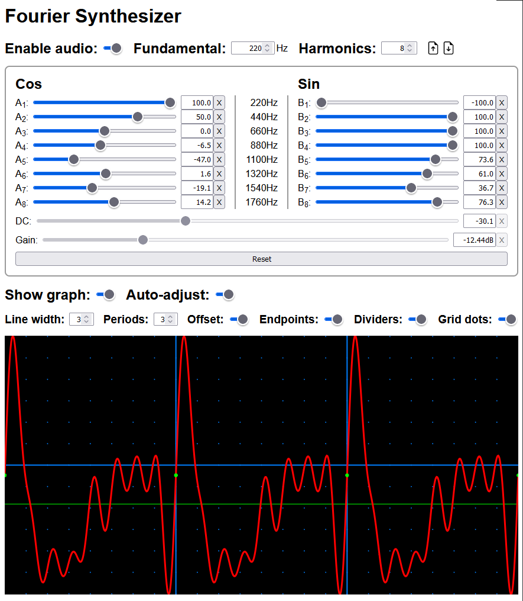

# [Fourier Synthesizer Web Component](https://github.com/gtranter/fourier-synth)

This project is a standalone Web Component for generating waveforms and audio using Fourier synthesis.

It was originally inspired by a Java Applet created by [Manfred Thole](https://thole.org/manfred/fourier/en_idx.html).




# Demo

[Link to demo page](https://unpkg.com/fourier-synth@1.1.1/fourier-synth.html).
<br></br>

# Features

- Waveforms can be saved and loaded via JSON files
- Real (cosine) and imaginary (sine) harmonic adjustment
- Adjustable fundamental frequency
- Unlimited number of harmonics
- Controls operate in real time
- Configurable graph options
- Fully customizable feature set including graph colors
- All text fully translatable (English is built-in)
<br></br>

# Develop

For information about development using this project see [DEVELOP.md](./DEVELOP.md).
<br></br>

# Use on the web

To use the Fourier Synthesizer web component on your web site, you need to import the component as a script and add the custom element tag to your page(s).

## Browser support

`Firefox` (as of v112) and `Safari` (as of v16.3) do not support the disable normalization feature of the Web Audio API. As a result, the DC Offset control will not work properly - it is not possible to "clip" the generated wave where it exceeds the maximum level (the limits of the graph area). For best results use a different browser such as `Edge`, `Opera`, or another `Chromium` variant. For more information on browser support see the [MDN documentation](https://developer.mozilla.org/en-US/docs/Web/API/BaseAudioContext/createPeriodicWave#browser_compatibility).

## Script import

Add a script tag to the `<head>` section of your page. Replace `https://my.domain/server-path/fourier-synth/` shown below with the path where the component files are stored on your server or elsewhere.
```html
<script type="module" src="https://my.domain/server-path/fourier-synth/fourier-synth.esm.js"></script>
```

### Hosting

Download one of the deploy files [fourier-synth@1.1.1.zip](./deploy/fourier-synth@1.1.1.zip) or [fourier-synth@1.1.1.tgz](./deploy/fourier-synth@1.1.1.tgz), and extract the contents. (The tgz file contains a tar file that needs to be extracted.) The extracted `fourier-synth` folder should be copied to your server including all contents. The name of the folder is not important, but it must match the `src` value of your page's script tag, and the file names must not be altered.

### Serving from unpkg.com
If you don't need guaranteed availability, you can use the component from unpkg.com.
```html
<script type="module" src="https://unpkg.com/fourier-synth@1.1.1/dist/fourier-synth/fourier-synth.esm.js"></script>
```

## Element tag

Add the element somewhere on your web page. Remember to use style or layout to control the size of the component.
```html
<fourier-synth style="width: 850px;">Please enable JavaScript to use Fourier Synthesizer</fourier-synth>
```

## Fonts & Styling

Fourier Synthesizer will use whatever font has been set in the page, along with the foreground color. It has no background color so you will see the page background. You can easliy customize any of these things through CSS applied to either the page or the `<fourier-synth>` element.

The width of the component should be controlled on the page through either layout or CSS width applied to the `<fourier-synth>` element.

To customize the colors of the graph, use the element attributes. See the [component documentation](./src/components/fourier-synth/readme.md#properties) for details.
<br></br>

# Customization & Localization

To customize the features of the component or translate into another language, see the [readme file](./src/components/fourier-synth/readme.md) for the web component.
<br></br>

# User Guide

The user guide for Fourier Synthesizer can be found [here](./USERGUIDE.md).
<br></br>

# Technical Support

 Technical support for using this component is not available - please try [Stack Overflow](https://stackoverflow.com/) instead.
